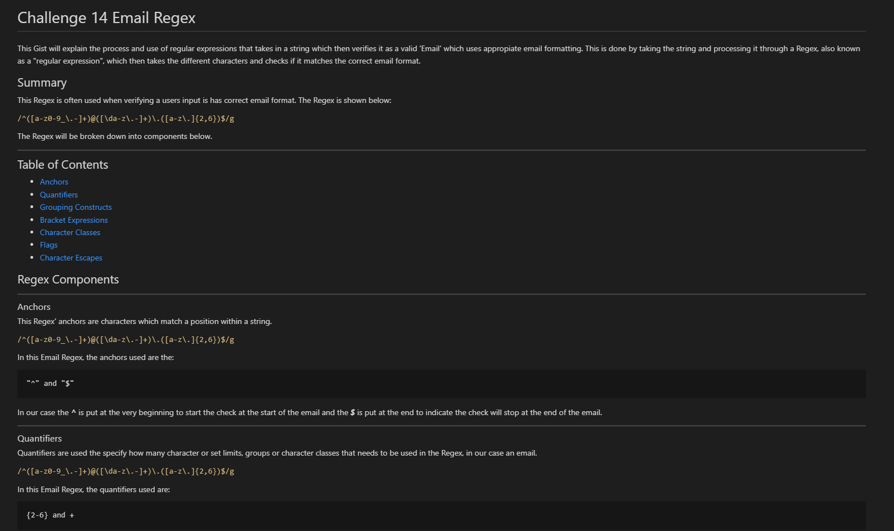

# Challange 17 Email Regex

The challenge required students to write about a specific Regex of their choice. The Regex that was chosen was the Email Regex which validated the input to make sure it was an Email. A Gist was then created to explain what the regex was doing step by step.

The file consists of a Gist-Email.md and a readme.md file.

Contents: Markdown

This file does not contain a link however can be viewed on [GitHub](https://github.com/RyanZade)

Please find attached a snippet screenshot of Challenge 17

My GitHub: [RyanZade](https://github.com/RyanZade)
